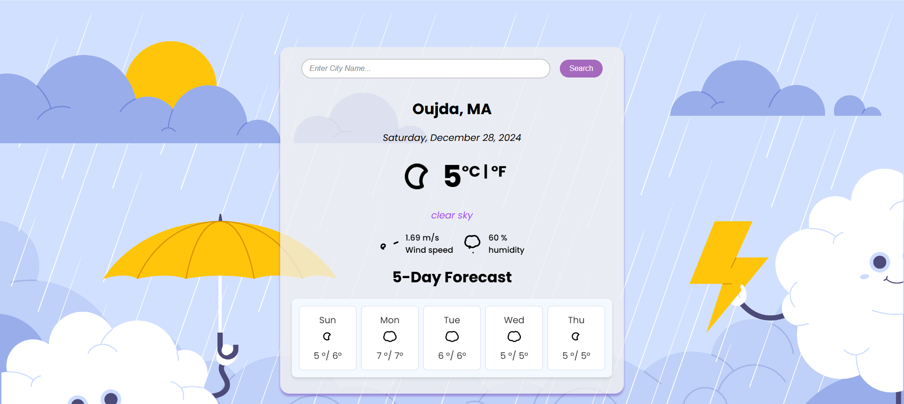

# Weather Forecasting Application ☀️

This project is a weather forecasting web application built with React. It allows users to search for weather forecasts by city name and displays the current weather and a 5-day forecast. The application fetches weather data from the OpenWeatherMap API and presents it in a user-friendly interface.

## Features:
- **Search Functionality**: Users can search for weather information by entering a city name.
- **Current Weather**: Displays the current weather conditions, including temperature, weather description, and wind speed.
- **5-Day Forecast**: Provides a 5-day weather forecast with daily temperature ranges and weather icons.
- **Temperature Conversion**: Users can toggle between Celsius and Fahrenheit for temperature display.
- **Responsive Design**: The application is designed to be responsive and works well on both desktop and mobile devices.

## Technologies Used:
- **React**: A JavaScript library for building user interfaces.
- **React Hooks**: For managing state and side effects.
- **React Animated Weather**: For displaying animated weather icons.
- **OpenWeatherMap API**: For fetching weather data.
- **CSS**: For styling the application.

## Project Structure:
- `src/`: Contains the source code for the application.
  - `components/`: Contains the SearchEngine and Forecast components.
  - `App.js`: The main application component.
  - `index.js`: The entry point of the application.
  - `index.css`: The main stylesheet for the application.
- `public/`: Contains the public assets and HTML file.
- `build/`: Contains the production build of the application.
- `images/`: Contains background images used in the application.

## How to Run:
1. Clone the repository.
2. Install dependencies using `npm install`.
3. Start the development server using `npm start`.
4. Open the application in your browser at `http://localhost:3000`.

## Future Enhancements:
- Add more detailed weather information such as hourly forecasts.
- Implement user authentication to save favorite cities.
- Improve error handling and user feedback.

This project provides a simple and intuitive way to check the weather forecast for any city, making it a useful tool for planning daily activities.

